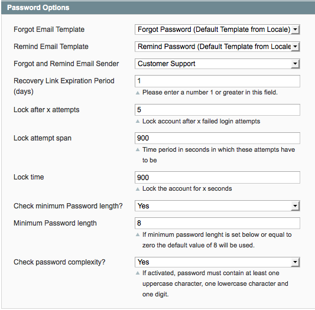

FireGento_Customer
<!-- ALL-CONTRIBUTORS-BADGE:START - Do not remove or modify this section -->
[](#contributors-)
<!-- ALL-CONTRIBUTORS-BADGE:END -->
==================

This extension extends the core functionality of the customer module of Magento. It is possible to temporarily lock the user account after an number of failed login attempts during specified period of time. Additionally it is possible to check the complexity and length of the customer password when an account is created.


Branches
--------
* master => stable version of the extension
* develop => contains new features

Facts
-----
- Version: check [config.xml](https://github.com/firegento/firegento-customer/blob/master/src/app/code/community/FireGento/Customer/etc/config.xml)
- [Extension on GitHub](https://github.com/firegento/firegento-customer/)

Description
-----------
This extension extends the core functionality of the customer module of Magento. The features of this extension are:

* Customers are temporarily deactivated if wrong password is entered too often.
* Password can be validated and rejected (password strength, password length, ..)

The extension can now be configured: *System -> Configuration -> Customer -> Customer Configuration -> Password*

The following extra options are available:

- **Lock after x attempts:** The number of allowed failed login attempts before the customer account is locked
- **Lock attempt span:** The time period within which the above attempts are allowed to be made
- **Lock time:** The number of seconds for which the account will be locked
- **Check minimum Password length:** Should the password length be checked (When the customer creates an account)
- **Minimum Password length:** The minimum allowed password length. If this value is set below or equal to zero the default value (8) will be used.
- **Check Password complexity:** Check password against the default complexity definition, where it should contain at least one uppercase character, one lowercase character and one digit.





Requirements
------------
- PHP >= 5.3.0

Compatibility
-------------
- Magento >= 1.6

Installation Instructions
-------------------------

Install the files using one of the following methods:
### Via modman
- Install [modman](https://github.com/colinmollenhour/modman)
- Use the command from your Magento installation folder: `modman clone https://github.com/firegento/firegento-customer.git`

### Via composer
- Install [composer](http://getcomposer.org/download/)
- Create a composer.json into your project like the following sample:

```json
{
    ...
    "require": {
        "firegento/customer":"*"
    },
    "repositories": [
	    {
            "type": "composer",
            "url": "http://packages.firegento.com"
        }
    ],
    "extra":{
        "magento-root-dir": "./"
    }
}

```

- Then from your composer.json folder: `php composer.phar install` or `composer install`

### Manually
You can copy the files from the 'src' folder of this repository to the same folders of your installation

Once the files are installed:

- Clear the cache, logout from the admin panel and then login again.

You can now configure the extension via *System -> Configuration -> Customer -> Customer Configuration -> Password*

Uninstallation
--------------
1. Remove all extension files from your Magento installation
2. Run the following sql script in your database:

```sql
DELETE FROM eav_attribute WHERE attribute_code = 'customer_active';
DELETE FROM eav_attribute WHERE attribute_code = 'customer_logins_failed';
DELETE FROM eav_attribute WHERE attribute_code = 'customer_last_login_failed';
```


Support
-------
If you have any issues with this extension, open an issue on [GitHub](https://github.com/firegento/firegento-customer/issues).

Contribution
------------
Any contribution is highly appreciated. The best way to contribute code is to open a [pull request on GitHub](https://help.github.com/articles/using-pull-requests).

Developer
---------
FireGento Team
* Website: [http://firegento.com](http://firegento.com)
* Twitter: [@firegento](https://twitter.com/firegento)

License
-------
[GNU General Public License, version 3 (GPLv3)](http://opensource.org/licenses/gpl-3.0)

Copyright
---------
(c) 2013 FireGento Team

## Contributors ✨

Thanks goes to these wonderful people ([emoji key](https://allcontributors.org/docs/en/emoji-key)):

<!-- ALL-CONTRIBUTORS-LIST:START - Do not remove or modify this section -->
<!-- prettier-ignore-start -->
<!-- markdownlint-disable -->
<table>
  <tr>
    <td align="center"><a href="https://rouven.io/"><br /><sub><b>Rouven Alexander Rieker</b></sub></a><br /><a href="https://github.com/firegento/firegento-customer/commits?author=therouv" title="Code">💻</a></td>
    <td align="center"><a href="http://www.mage-profis.de/"><br /><sub><b>Mathis Klooß</b></sub></a><br /><a href="https://github.com/firegento/firegento-customer/commits?author=mklooss" title="Code">💻</a></td>
    <td align="center"><a href="https://github.com/latenzio"><br /><sub><b>Latenzio Gonzales</b></sub></a><br /><a href="https://github.com/firegento/firegento-customer/commits?author=latenzio" title="Code">💻</a></td>
    <td align="center"><a href="http://vinaikopp.com/"><br /><sub><b>Vinai Kopp</b></sub></a><br /><a href="https://github.com/firegento/firegento-customer/commits?author=Vinai" title="Code">💻</a></td>
    <td align="center"><a href="https://github.com/pixelhed"><br /><sub><b>Andre Flitsch</b></sub></a><br /><a href="https://github.com/firegento/firegento-customer/commits?author=pixelhed" title="Code">💻</a></td>
  </tr>
</table>

<!-- markdownlint-enable -->
<!-- prettier-ignore-end -->
<!-- ALL-CONTRIBUTORS-LIST:END -->

This project follows the [all-contributors](https://github.com/all-contributors/all-contributors) specification. Contributions of any kind welcome!